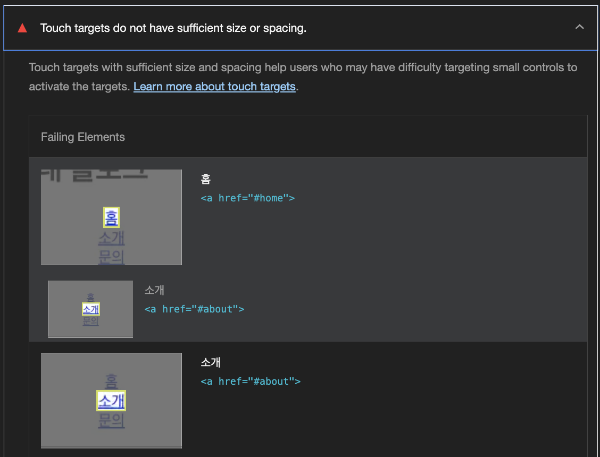
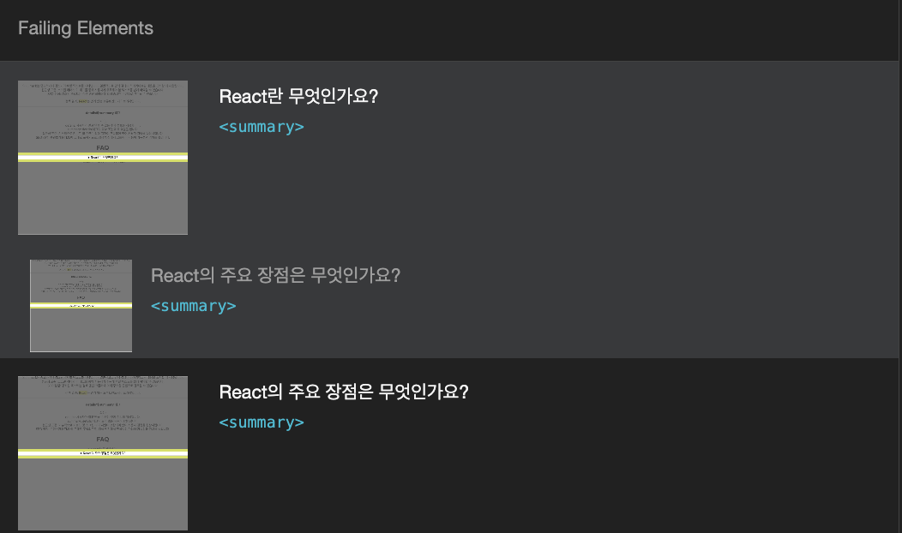
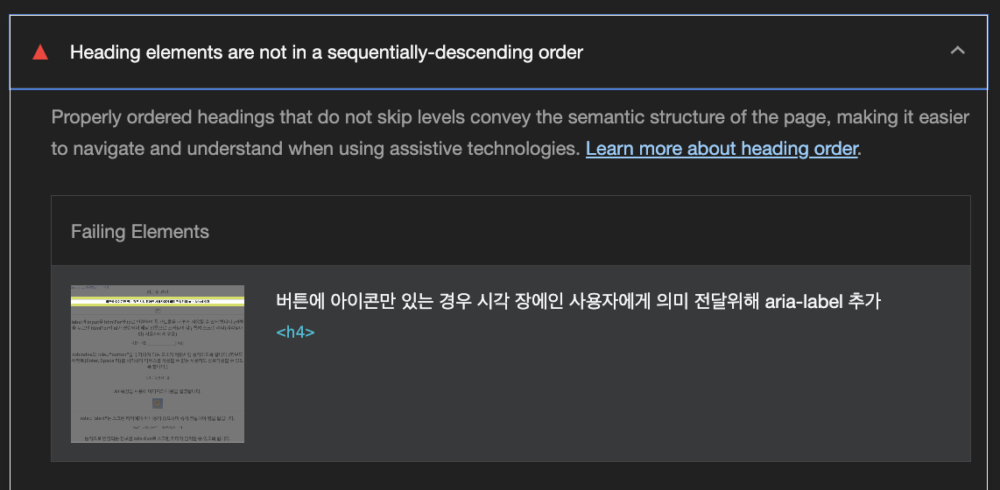
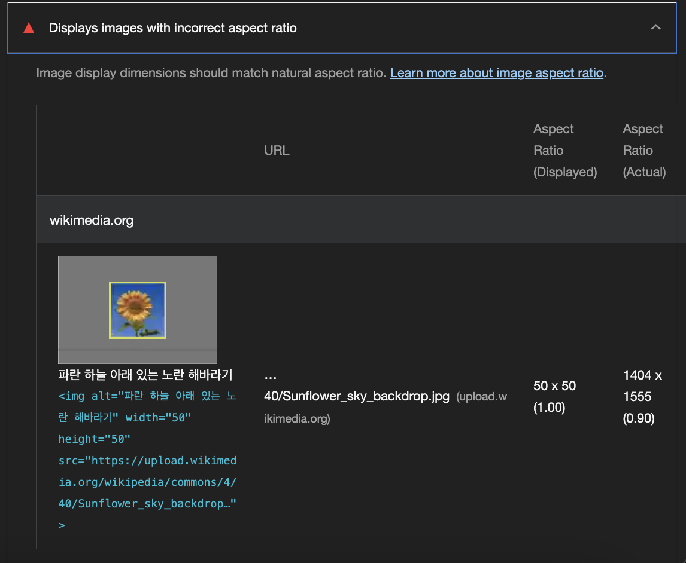

## Lighthouse Accessability 측정 및 수정 방향
- [Lighthouse Accessability 측정 및 수정 방향](#lighthouse-accessability-측정-및-수정-방향)
  - [태그 아이디 중복으로 인한 접근성 저하 케이스](#태그-아이디-중복으로-인한-접근성-저하-케이스)
  - [ARIA input fields do not have accessible names(입력 필드에 액세스 가능한 이름이 없으면 화면 판독기가 이를 일반 이름으로 알려 주므로 화면 판독기에 의존하는 사용자가 사용할 수 없게 됩니다. 이슈)](#aria-input-fields-do-not-have-accessible-names입력-필드에-액세스-가능한-이름이-없으면-화면-판독기가-이를-일반-이름으로-알려-주므로-화면-판독기에-의존하는-사용자가-사용할-수-없게-됩니다-이슈)
  - [Touch targets do not have sufficient size or spacing.(터치 대상의 크기가 너무 작아 접근성이 떨어짐)](#touch-targets-do-not-have-sufficient-size-or-spacing터치-대상의-크기가-너무-작아-접근성이-떨어짐)
  - [Heading elements are not in a sequentially-descending order(잘못된 페이지 제목 순서 구조)](#heading-elements-are-not-in-a-sequentially-descending-order잘못된-페이지-제목-순서-구조)
  - [Displays images with incorrect aspect ratio(원본 이미지와 다른 잘못된 종횡비로 이미지를 표시하는 경우)](#displays-images-with-incorrect-aspect-ratio원본-이미지와-다른-잘못된-종횡비로-이미지를-표시하는-경우)

### 태그 아이디 중복으로 인한 접근성 저하 케이스

- id는 한 문서에 같은 id가 중복해서 있는경우 위와 같이 이미지가 뜸
- 따라서 두 태그의 아이디가 같다면 서로 다른 아이디를 지정해줘야함

### ARIA input fields do not have accessible names(입력 필드에 액세스 가능한 이름이 없으면 화면 판독기가 이를 일반 이름으로 알려 주므로 화면 판독기에 의존하는 사용자가 사용할 수 없게 됩니다. 이슈)

- 기존 코드의 문제점
  - listbox에 에 매핑된 aria-label이 없어 생기는 문제
```js
<h2>키보드로 리스트 항목을 선택할 수 있도록 이벤트를 처리합니다.</h2>
    <ul role="listbox" onKeyDown={handleKeyDown} tabIndex="0">
      {items.map((item, index) => (
        <li
          key={index}
          role="option"
          aria-labelledby={item}
          aria-selected={selectedIndex === index}
          style={{
            backgroundColor: selectedIndex === index ? '#ddd' : 'transparent',
          }}
        >
          {item}
        </li>
      ))}
    </ul>
```

- 수정 후 코드
  - h4가 라벨의 역할을하기 때문에 id를 입력해주고 그와 listbox로 지정한 태그에 aria-labelledby 속성에 h4의 id를 넣어줌으로서 해결
  - 기대효과:
  - 효과:
    - aria-labelledby="listbox-label"를 통해 `<ul role="listbox">`는 `<h2 id="listbox-label">`의 텍스트(즉, "키보드로 리스트 항목을 선택할 수 있도록 이벤트를 처리합니다.")를 접근성 이름으로 갖게 됩니다.
    - 화면 읽기 도구(Screen Readers)는 이 리스트를 "키보드로 리스트 항목을 선택할 수 있도록 이벤트를 처리합니다."라는 이름으로 읽게 됩니다.
```js
import React from 'react';

export default function KeyboardList() {
  const items = ['항목 1', '항목 2', '항목 3'];
  const [selectedIndex, setSelectedIndex] = React.useState(0);

  const handleKeyDown = (e) => {
    if (e.key === 'ArrowDown') {
      setSelectedIndex((prev) => (prev + 1) % items.length);
    } else if (e.key === 'ArrowUp') {
      setSelectedIndex((prev) => (prev - 1 + items.length) % items.length);
    }
  };

  return (
    <>
     
----------------------------------------------------------
(-)   <h2>키보드로 리스트 항목을 선택할 수 있도록 이벤트를 처리합니다.</h2>
----------------------------------------------------------
      <h2 id="listbox-label">키보드로 리스트 항목을 선택할 수 있도록 이벤트를 처리합니다.</h2>
----------------------------------------------------------      
(-)    <ul role="listbox" onKeyDown={handleKeyDown} tabIndex="0">
----------------------------------------------------------
      <ul
        role="listbox"
        aria-labelledby="listbox-label"
        onKeyDown={handleKeyDown}
        tabIndex="0"
      >
        {items.map((item, index) => (
          <li
            key={index}
            role="option"
            aria-selected={selectedIndex === index}
            style={{
              backgroundColor: selectedIndex === index ? '#ddd' : 'transparent',
            }}
          >
            {item}
          </li>
        ))}
      </ul>
      <hr />
    </>
  );
}

```

### Touch targets do not have sufficient size or spacing.(터치 대상의 크기가 너무 작아 접근성이 떨어짐)
- 터치 대상의 영역이 아래와 같이 작은 경우 사용자가 정확히 누르기 어렵고 모바일에선 손가락으로 눌러야하기에 더 누르기가 힘들어 접근성이 떨어짐


- 문제 코드
```js
      <nav>
        <ul>
          {/* a태그의 정해진 터치 영역이 없어 누르기 어려움 */}
          <li><a href="#home">홈</a></li>
          <li><a href="#about">소개</a></li>
          <li><a href="#contact">문의</a></li>
        </ul>
        <details>
          {/* summary 태그의 정해진 터치 영역이 없어 누르기 어려움 */}
          <summary>React란 무엇인가요?</summary>
          <p>React는 사용자 인터페이스를 만들기 위한 JavaScript 라이브러리입니다.</p>
        </details>
      </nav>
```

- 해결방법: 해당 태그의 최소 최대 높이를 지정해줘 클릭과 터치하기 쉽도록 영역 조정이 필요
- 웹 표준 콘텐츠 접근성 가이드라인(WCAG)은 터치 대상을 다음과 같이 정의
  - 터치 가능한 크기: 터치 대상의 최소 크기는 48 x 48 픽셀이어야 합니다.
    - 이 크기는 손가락 크기와 터치 정확도를 고려한 표준입니다.
  - 터치 대상 간격: 터치 대상 간에 적절한 간격을 유지해야 합니다.
    - 인접한 터치 대상 간에는 최소 8픽셀 이상의 공간을 유지하는 것이 권장됩니다.
- 해결코드: **주의** 이 예제를 러프하게 잡은 것이며 상황에 따라 적절하게 할것
  - 설명: 해당 태그에 최소 height, width를 48로 지정해줄것
```css
nav > ul > li > a {
  display: block;
  min-width: 48px;
  min-height: 48px;
}
summary {
  display: block;
  min-width: 48px;
  min-height: 48px;
}
```

### Heading elements are not in a sequentially-descending order(잘못된 페이지 제목 순서 구조)
- 문서 구조에서 제목의 순서는 항상 h1, h2, h3, h4 순으로 구성되어야 하며, 계층을 건너뛰거나 무작위로 사용해서는 안된다.
- 최상위 제목이 h2라면 h2부터 순서대로 배치되어야함

- 문제 코드
```js
<h2>접근성관련</h2>
<h4>이건 제목</h4>
```

- 해결 코드
```js
<h2>접근성관련</h2>
<h3>이건 제목</h3>
```

### Displays images with incorrect aspect ratio(원본 이미지와 다른 잘못된 종횡비로 이미지를 표시하는 경우)
- 원본 이미지의 비율과 다르게 렌더링하는 경우 발생


- 문제 코드
  - 50 * 50을 강제로 설정
```js
    
```

- 해결 코드: **주의** 이 예제를 러프하게 잡은 것이며 상황에 따라 적절하게 할것
  - css에서 object-fit 속성으로 cover 또는 contain으로 처리할 것
    - cover: 이미지를 부모 영역에 맞게 채우되, 비율을 유지.
    - contain: 이미지를 부모 영역에 맞추되, 비율을 유지하며 잘리지 않음.
```js
    
```
```css
img {
  object-fit: cover; /* 또는 contain */
}
```


